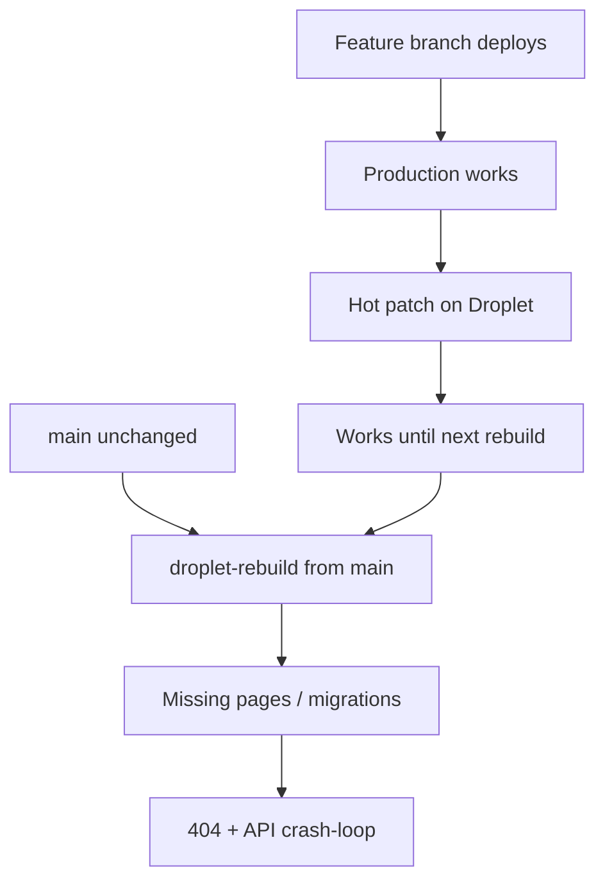

# Mainline parity — why the backlog page 404’d and how we prevent it

## What went wrong

Three things stacked:

1. **Production lived on a Cursor feature branch**, not `main`. The backlog page, ops remediation, Baltimore backfill, migrations `20260603`–`20260607`, and most operator-console upgrades were merged to `origin/cursor/fix-address-backfill-stuck-55fd` and deployed from there (often via GHCR or Droplet rebuilds off that tree).

2. **`main` stayed months behind.** GitHub’s default branch and the Mac clone tracked `main`, which did not contain those files. A rebuild from `main` compiled an operator console **without** `/operator/backlog` and an API **without** matching migrations → 404s and crash-loops.

3. **Hot patches on the Droplet without merging back.** During incidents we copied files from GHCR or edited on-server. That fixed production temporarily but did not update `main`, so the next `make droplet-rebuild` repeated the loss.



## What we fixed

- Fast-forward merged `origin/cursor/fix-address-backfill-stuck-55fd` into `main`.
- Merged droplet-workspace and skip-trace operator upgrades.
- Re-applied load governor, crew, and enrichment work on top.
- Added `scripts/check-mainline-parity.sh` (CI + pre-deploy gate).

## Rules going forward

| Rule | Why |
|------|-----|
| **`main` is the only deploy source** | `make droplet-sync` / `droplet-rebuild` must run from a tree whose `HEAD` is on `main` (or a PR branch about to merge). |
| **Merge before rebuild** | No “fix on Droplet only.” If it ships, it commits to `main` the same day. |
| **Run parity check** | `bash scripts/check-mainline-parity.sh` before `make droplet-rebuild`. CI runs it on every API test job. |
| **Prefer GHCR only when tag = main** | If using `prod-up-ghcr`, the image tag must match a `main` commit that passed parity + tests. |
| **One Cursor window = parkinglot Droplet** | Open `parkinglot-droplet.code-workspace` so agents edit the same tree you deploy. |

See also [PR-DEPLOY-POLICY.md](PR-DEPLOY-POLICY.md): implementation PRs should not stay draft when the user expects deployment, and high-risk ops PRs need an explicit deploy/merge path.

## Quick checks

```bash
# Must pass before deploy
bash scripts/check-mainline-parity.sh
make run-api-tests

# After deploy
curl -sS -o /dev/null -w "%{http_code}\n" https://vspecialist.com/operator/backlog
```

Expected: `200` on backlog, API `/ready` healthy, no alembic revision errors in `deploy-api-1` logs.
