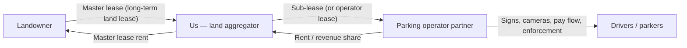

# Operations model (Kent + King pilot)

**Canonical reference** for how we operate parking sites, who our partners are, and what this stack is *not* optimizing for. Agents and operators should read this before scoring, outreach, memos, or deal recommendations.

**Config mirror:** `config/pilot.yaml` → `deal.operations` (machine-readable subset).

---

## Two-tier structure

We sit between the **landowner** and the **parking operator** who runs paid parking on the ground.

| Party | Role | Typical agreement |
|-------|------|-------------------|
| **Landowner** | Owns the parcel | **Master lease** (or ground lease) with us — we lease land for **primary use as unmanned surface paid parking** |
| **Us** | Identify sites, negotiate land, hold lease, sub-let operating rights | Master lease ↑; **sub-lease** ↓ to operator partner |
| **Operator partner** | Installs and runs paid parking infrastructure | **Sub-lease** or **operator lease** (partner keeps revenue above rent, bears ops risk) — see [Partner economics](#partner-economics) |

**We do not** operate cameras, enforcement, or day-to-day parking ourselves in the pilot model. We **master-lease the land**, then **sub-lease to a partner** who deploys signs, LPR cameras, payment, and enforcement.

Legal templates in-repo may label the landowner agreement `ground_lease` (`deal.primary_structure` in `config/pilot.yaml`). Counsel may treat ground lease and master lease as equivalent for unmanned surface parking; the **economic intent** is always: **we control the land term; the partner controls operations and CapEx on the operating equipment**.

---

## What we build (and what we exclude)

### In scope

- **Standalone, unmanned surface parking** on the portion of the parcel we lease
- **Primary use** = paid public (or permitted) parking on that surface — not accessory parking for another primary building
- **Partially developed lots** may qualify (e.g. building on half the lot, empty half suitable for surface stalls) — still needs zoning + counsel review; building-value ≤70% prescreen is a roll-data proxy for undeveloped capacity

### Out of scope (unless user explicitly changes pilot scope)

- Staffed garages, valet, or attendant booths as the operating model
- Accessory-only parking (serving a tenant building with no standalone pay parking)
- We do **not** recommend attended garages or valet as pilot targets

---

## What the operator partner provides

Turnkey partners typically deliver **end-to-end unmanned operations**:

| Layer | Examples |
|-------|----------|
| **Site prep** | Striping, signage, QR/pay-by-phone instructions, optional gates |
| **Hardware** | LPR/ANPR cameras (entry/exit or lot perimeter), optional kiosks |
| **Software** | Pay-by-plate, mobile web / SMS pay, permits, dynamic pricing dashboards |
| **Enforcement** | Violation detection, citations, boot/tow coordination where legal |
| **Ops** | 24/7 monitoring, revenue reporting, maintenance of **their** equipment |

Many partners offer **zero upfront CapEx**: they fund cameras and signs and recover cost via **revenue share** or **operator lease rent** to us. That aligns with our model — we hold land; they hold operating risk and equipment.

---

## Partner economics

Industry-standard structures (partner ↔ us, after we already master-lease from owner):

1. **Sub-lease / operator lease (preferred for pilot)** — Partner pays us **fixed base rent** (or minimum guarantee + revenue share above a threshold). Partner keeps parking revenue net of ops; partner funds signage/cameras. Predictable income for us; partner has incentive to maximize revenue.
2. **Management agreement (less common for us)** — Partner runs the lot for a **fee** (% of gross, often 8–15%) but **we** retain revenue risk and often CapEx. Usually a worse fit unless we intentionally hold operating upside.

When evaluating partners, prefer those who will **sub-lease or fixed-rent lease** unmanned surface lots and **fund installation** without requiring us to buy PARCS hardware.

---

## Partner landscape (research summary)

Partners fall into three buckets. For our model, **Category A** (full-stack operator) is the primary outreach target; **B** is relevant if we self-operate tech later; **C** is usually a vendor to the operator, not our counterparty.

### Category A — Full-stack operators (tech + ops + CapEx)

Best fit for **sub-lease**: they already run third-party surface lots with LPR and mobile pay.

| Company | Notes | Pilot markets |
|---------|-------|----------------|
| **[Metropolis](https://www.metropolis.io/parking)** | Largest U.S. operator (~4,600 sites); LPR + AI; zero CapEx positioning; acquired SP+. Strong **Baltimore** presence (~100 locations, 2024+). Also active at major airports (e.g. BWI, SEA). | Baltimore ★★★, Puget Sound ★★ |
| **[Diamond Parking](https://www.diamondparking.com/)** | Seattle-founded (1922); **600+ surface lots** in Seattle region; LPR (e.g. Genetec); flexible lease/management structures. | Puget Sound ★★★, Baltimore ○ |
| **[PMS Parking](https://pmsparking.com/)** | **Baltimore HQ**; MD/DC/VA; SBE/MBE; garages + lots; traditional operator adding digital. Local relationship asset. | Baltimore ★★★ |
| **[National Parking / Parkify](https://national-parking.com/services/digital-parking-management/)** | Gateless LPR; QR/SMS pay; **zero CapEx**; revenue share or flat fee. | National / both markets |
| **[Towne Park — T-Park](https://insights.townepark.com/t-park)** | Gateless QR/text pay; turnkey signage + software; no capital from property. Often hospitality-adjacent but surface-capable. | National |
| **[Wins Parking](https://winsparking.com/manage)** | AI LPR; **20–30% revenue share** full-service or **8–15%** tech-only; unmanned positioning. | National |
| **[Flash Parking](https://www.flashparking.com/parking-technology/)** | LPR platform + ops; gated/ungated; strong enterprise installs. | National, airport/mixed-use |
| **[Reimagined Parking](https://reimaginedparking.com/)** (formerly Impark+) | Very large NA portfolio; management vs lease models. | National |

### Category B — Hardware + software (may operate or sell through integrators)

Useful if a Category A operator is unavailable; may require us to pick an local ops layer.

| Company | Notes |
|---------|-------|
| **[Parking BOXX](https://parkingboxx.com/)** | Manufacturer + CloudEASE; LPR, kiosks, install support; **Baltimore** office/market page. |
| **[Autopay Technologies](https://solutions.autopay.io/)** | ANPR-first, barrier-free; strong in Europe, expanding NA. |
| **[T2 Systems](https://www.t2systems.com/)** | Parking management **platform** (permits, enforcement, integrations) — often paired with a local operator. |

### Category C — Payment rails (usually not our direct partner)

Operators white-label these; good to know for diligence.

| Company | Notes |
|---------|-------|
| **EasyPark Group** (ParkMobile, Passport, etc.) | Mobile payment + enforcement integrations |
| **PayByPhone** | Municipal and private pay-by-phone |

---

## Suggested priority for outreach

| Priority | Market | First contacts | Why |
|----------|--------|----------------|-----|
| 1 | **Baltimore** | Metropolis, PMS Parking, National Parking/Parkify | Metropolis density + local PMS; turnkey zero-CapEx options |
| 2 | **Puget Sound / WA** | Diamond Parking, Metropolis, Flash, National Parking | Diamond local scale on surface lots; Metropolis airport/commercial footprint |
| 3 | **National backup** | Towne Park T-Park, Wins Parking, Reimagined Parking | Turnkey gateless models if regional players pass on site size or zoning |

**Diligence questions** for any partner:

1. Will you **sub-lease** (or pay fixed rent) on **unmanned surface** lots under **5–50 stalls**?
2. Who funds **Cameras, signs, striping** — CapEx fully yours?
3. Minimum term and **exit** if zoning or revenue underperforms?
4. **Revenue share** vs fixed rent to us — and pass-through of property tax / insurance?
5. Experience in **our jurisdiction** (Baltimore City/County, King County, etc.)?

---

## Landowner terms (positioning for a partner sub-lease)

**Not legal advice** — have counsel review every lease. These are the terms that make operators willing to sub-lease from you and give you room to earn a spread between land rent and operator rent.

### Must-haves (deal-breakers for partners)

| Term | What to push for | Why the operator cares |
|------|------------------|------------------------|
| **Sublease / assignment** | **Unrestricted right to sublease** parking operations to third-party operators (or assign to an affiliate), with **no landlord consent** or consent **not to be unreasonably withheld** for qualified parking operators | Operators will not fund cameras on a site you cannot legally sublet |
| **Use clause** | **Exclusive** right to operate **paid, unmanned surface parking** as the **primary use** on the leased area; include **LPR cameras, signage, pay-by-phone/QR, striping, optional gates, and enforcement** as permitted | Vague “parking” language blocks tech and enforcement |
| **Term length** | **Initial term 10–15 years** (or 5 years minimum + **2–3 renewal options** you control); align with operator CapEx payback (~3–7 years on equipment) | Shorter terms = operators pass or demand higher rent from you |
| **Early access** | **Free or nominal-rent** period (3–12 months) for zoning, surveys, partner diligence, and **non-revenue install** before grand opening | You need time before you can pay full rent or sub-lease revenue |
| **Exclusive use** | Owner **won’t operate or allow** competing paid parking on the same parcel (or shared drive aisles) | Protects operator revenue and your sub-lease economics |
| **Possession** | Deliver **vacant, usable** portion of the lot (or defined pad); **as-is** acceptable if price reflects it | Partner quotes stall count and layout from day one |
| **Utilities & access** | **Easements** for power, telecom, and **camera/data** lines; 24/7 **vehicular and pedestrian access** for parkers | Gateless LPR still needs power and connectivity |
| **Signage** | Right to install **ground and pole signage** (and building signage if partial lot) without separate owner fee | Operators depend on QR/pay instructions at curb |
| **SNDA** | If mortgaged: **subordination, non-disturbance, and attornment** from owner’s lender so your lease survives foreclosure | Standard operator diligence item |

### Strongly prefer (creates negotiating room)

| Term | What to push for | Why it helps you |
|------|------------------|------------------|
| **Base rent** | **Low fixed base** during ramp + **percentage rent** or **revenue share** above a breakpoint (e.g. owner gets 10–20% of gross parking revenue above base rent) | Keeps owner aligned; preserves **spread** for operator sub-rent and your fee |
| **Rent abatement** | Full or partial abatement until **(a)** zoning/use confirmed and **(b)** operator partner ready to open — or capped dollar amount | You are not paying full land rent while unentitled |
| **Taxes & insurance** | **Net lease**: you pay property tax, insurance, and ordinary maintenance on leased area (or reimburse owner) — **pass through** in operator sub-lease | Operators expect predictable pass-throughs in their pro forma |
| **Improvements** | **Your equipment / operator equipment** remains **personal property** of operator (or you); **striping/surface** — who owns at end should match who paid | Avoids fight at lease end that scares operators |
| **Termination** | **No owner termination without cause** in first **5+ years**; long **cure periods** (60–90 days); **operator-friendly** casualty/condemnation (rent abatement, termination right if pad destroyed) | Operators need stability to install CapEx |
| **Partial parcels** | **Metes-and-bounds** or survey of leased pad only; **access easement** across owner’s retained land if needed | Common on half-developed lots |
| **Entitlements** | Owner **cooperates** (signatures, easements, neighbor access) on zoning/BMZA/conditional use; cost split **negotiated** (often you/operator pay filing fees) | Baltimore **CB** districts need this path |
| **Options** | **Purchase option** or **right of first offer** optional — separate from operating lease; don’t let it block sublease | Already in `allowed_structures`; keep ops lease clean |

### What to avoid (puts you in a bad spot with partners)

- **Consent for each sublease** or owner approval of “business plan” — kills speed and operator interest
- **Short term** (1–3 years) with no renewals — operators won’t install LPR
- **Gross rent** with **no clarity** on taxes/insurance — your sub-lease math breaks
- **Owner retains parking revenue** or runs their own pay stations on the same lot
- **Broad use restrictions** (no overnight, no enforcement, no cameras) — incompatible with unmanned paid parking
- **Personal guarantee** from you on land rent without matching operator **minimum guarantee** in sub-lease
- **High base rent from day one** with no ramp — you pay owner before operator revenue exists

### Simple economics check before you sign with owner

1. Estimate **gross parking revenue** (see [TOP-PARCEL-DEAL-CONTEXT.md](TOP-PARCEL-DEAL-CONTEXT.md)).
2. Subtract **owner rent** (base + any revenue share).
3. Subtract **taxes, insurance, pass-throughs**.
4. What’s left must cover **operator sub-rent** (or their revenue share to you) **and** still leave the operator enough margin — typically they want **20–35%** of gross for ops + CapEx recovery on small lots, or a **fixed sub-rent** they can underwrite from comps.

If step 4 fails on paper, renegotiate **lower base**, **longer abatement**, or **higher share only above a breakpoint** — not a higher fixed rent to the owner.

### Order of operations

1. **LOI with owner** on term, use, sublease rights, exclusivity, and rent ramp.
2. **Confirm zoning path** (especially Baltimore conditional use).
3. **Soft-circle 1–2 operators** with address, stall count, and **your proposed sub-lease heads of terms**.
4. **Finalize land lease** with conditions precedent tied to entitlement + operator LOI.
5. **Sign operator sub-lease**, then install.

---

## How this repo uses the model

| Area | Behavior |
|------|----------|
| **Scoring** | Favors zoning-permitted **surface** parking, lot size, demand POIs, nearby **paid parking comps** — proxies for sub-lease viability |
| **Deal memos / contracts** | Landowner-facing drafts use `ground_lease` template; **sub-lease to operator** is a separate counsel-reviewed template (not auto-generated in early pilot) |
| **Operator console** | Pipeline phases: owner contact → land contract → **development/operator partner** → operational ([OPERATOR-CONSOLE.md](OPERATOR-CONSOLE.md)) |
| **Agents** | Do not recommend staffed garages, valet, or accessory-only parking as default pilot targets |

---

## Related docs

- [PROJECT-FACTS.md](PROJECT-FACTS.md) — infra paths and product name
- [config/pilot.yaml](../config/pilot.yaml) — `deal.operations` flags
- [compliance-checklist.md](compliance-checklist.md) — counsel review before any contract send
- [TOP-PARCEL-DEAL-CONTEXT.md](TOP-PARCEL-DEAL-CONTEXT.md) — revenue comps for underwriting sub-lease rent

**Last updated:** 2026-06-02 — partner list from public web research; verify terms and appetite directly with each company before LOI.
