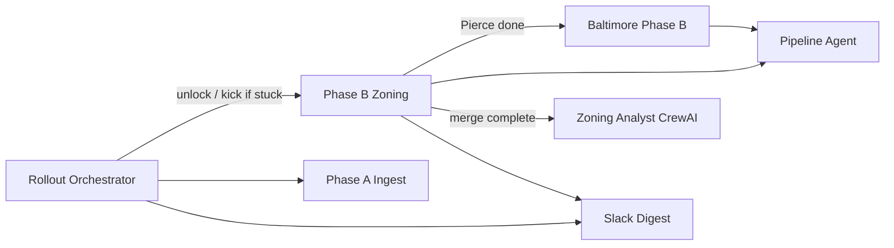

# Rollout agents plan — complete A→B→C county pipeline autonomously

This plan defines **who does what** across parcel ingest (Phase A), zoning merge (Phase B),
scoring/outreach (Phase C), and market-specific follow-up (Baltimore). Each row names an
**agent**, whether we **keep / augment / replace** what exists today, and what gets built.

**North star:** An operator can deploy once and the Droplet progresses counties without
manual `wa-phase-b-rollout-now` kicks, stale-lock surgery, or wondering why Baltimore stalled.

**Related docs:** [PHASED-EXECUTION-PLAN-A-E.md](PHASED-EXECUTION-PLAN-A-E.md),
[JURISDICTION-ZONING-COMPLETENESS-PLAN.md](JURISDICTION-ZONING-COMPLETENESS-PLAN.md),
[config/rollout_agents.yaml](../config/rollout_agents.yaml).

---

## Current state (summary)

| Layer | What exists | Problem |
|-------|-------------|---------|
| Celery Beat | WA Phase A/B ticks, priority pipeline, address health | No supervisor; stale locks block queue; Baltimore decoupled awkwardly |
| Slack personas | Ingest, Atlas/Beacon, Zoning acquisition events | Reporting only — no remediation |
| CrewAI crew | Zoning / Revenue / FinOps analysts | Manual/on-demand; not tied to merge completion |
| Operator agents | Address health, admin UI Playwright | Address-focused; no rollout queue ownership |
| Ops remediation | Baltimore score/demand backfill | Reactive; not county-queue aware |

---

## Agent roster — disposition

| # | Agent | Type | Disposition | Role |
|---|-------|------|-------------|------|
| 1 | **Rollout Orchestrator** | Celery (deterministic) | **BUILD** (new) | County queue health, stale lock recovery, chain triggers, Beat supervisor |
| 2 | **Phase A Ingest Agent** | Celery `wa_statewide_rollout_tick` | **KEEP** | WaTech county parcel load when queue/governor allow |
| 3 | **Phase B Zoning Agent** | Celery `fetch_build_merge_wa_county_zoning` | **KEEP + augment** | Overlay build + merge; Redis lock (shipped); orchestrator supervises |
| 4 | **Baltimore Phase B Agent** | Celery `merge_baltimore_zoning_overlay` | **KEEP + augment** | Staged overlay merge; triggered by orchestrator chain after Pierce handoff |
| 5 | **Pipeline Agent** | Celery `run_pipeline` + priority enqueue | **KEEP** | Atlas/Beacon/Cartographer scoring after zoning lands |
| 6 | **Address Health Agent** | Script + Beat | **KEEP** | Situs coverage waves; later: activate wave 2–4 when orchestrator signals |
| 7 | **Ops Remediation Agent** | Celery `ops_remediation_loop` | **AUGMENT** | Add orchestrator context (which county is active) to avoid fighting Phase B |
| 8 | **Zoning Analyst (CrewAI)** | LLM crew | **AUGMENT** | Post-merge QA audit per county (scheduled after Phase B completion) |
| 9 | **Revenue Actuary (CrewAI)** | LLM crew | **KEEP** | After zoning QA passes for pilot county |
| 10 | **FinOps Comptroller (CrewAI)** | LLM crew | **AUGMENT** | Recommend deprioritize counties with zero zoning progress |
| 11 | **Slack Digest / Plan Progress** | Celery slack queue | **AUGMENT** | Orchestrator feeds structured rollout block |
| 12 | **Operator Admin Agent** | GHA Playwright | **KEEP** | UI stagnation — separate concern |
| 13 | **Site Watchdog** | Celery + GHA | **KEEP** | Uptime — separate concern |
| 14 | **Owner Outreach Builder** | Pipeline deterministic | **KEEP** | Phase C briefs — not LLM |

**Do not replace:** Scoring personas (Atlas/Beacon/Cartographer) — they are profiles, not agents.

**Do not rebuild:** Entire CrewAI crew — augment tasks and scheduling instead.

---

## Phase 1 — Supervisor + chain (week 1) ✅ in progress

**Goal:** Pierce → Baltimore → next WA county runs without manual intervention.

| Task | Owner agent | Exit criteria |
|------|-------------|---------------|
| Stale Phase B Redis lock recovery | Rollout Orchestrator | Dead Celery tasks no longer block merges |
| Pierce merge completes | Phase B Zoning Agent | `wa_phase_b_county_merge_completed` for `53053` |
| Baltimore auto-enqueued | Baltimore Phase B Agent | Task queued when Pierce completes + overlay exists |
| Orchestrator Beat every 30m | Rollout Orchestrator | `rollout_orchestrator_tick` in Beat + tests |
| Document registry | `config/rollout_agents.yaml` | All agents listed with triggers |

**Shipped in repo:** `rollout_orchestrator.py`, `merge_baltimore_zoning_overlay` chain, Phase B duplicate locks.

---

## Phase 2 — County expansion + QA loop (weeks 2–4)

**Goal:** Snohomish, Kitsap, Thurston, Benton complete with QA signoff.

| Task | Owner agent | Exit criteria |
|------|-------------|---------------|
| Per-county overlay builders in `wa_phase_b_rollout.yaml` | Phase B Zoning Agent | 6 WA counties automated |
| Post-merge CrewAI audit | Zoning Analyst (augment) | `parking-crew audit --county FIPS` scheduled after each merge |
| Jurisdiction registry updates | Human + Zoning Analyst | `zoning_followup` status moves toward `in_progress` |
| City GIS source discovery | Human (GIS) + registry CSV | Seattle, Tacoma, etc. documented in source catalog |
| Orchestrator: skip re-merge | Phase B Zoning Agent | `phase_b_remerge_min_missing_pct` respected |

**Build:** `scripts/droplet-crew-county-audit.sh` + Beat hook from orchestrator when merge completes.

---

## Phase 3 — Baltimore primary market complete (week 2–3, parallel)

**Goal:** Baltimore entitlement scores reflect zoning; priority pipeline ranks real targets.

| Task | Owner agent | Exit criteria |
|------|-------------|---------------|
| Baltimore overlay merge to completion | Baltimore Phase B Agent | `parcels_missing_zoning_code` for `24510` < 10% |
| Priority pipeline on 24510 | Pipeline Agent | Qualified parcels with non-zero zoning weight |
| Ops remediation pass | Ops Remediation Agent | Baltimore prescreen/demand gaps reduced |
| Revenue actuary spot-check | Revenue Actuary (CrewAI) | Optional audit after Baltimore merge |

**Augment:** Register Baltimore Phase B in `operator_agents.yaml` (alongside address health).

---

## Phase 4 — Address + value layers (weeks 4–8)

**Goal:** Situs and assessor value fields support outreach and scoring.

| Task | Owner agent | Exit criteria |
|------|-------------|---------------|
| Address wave 1 completion | Address Health Agent | Wave 1 counties hit coverage target |
| Orchestrator activates wave 2 | Rollout Orchestrator (augment) | Reads `address_rollout_plan.yaml` completion |
| WA centroid backfill | Celery backfill tasks | `wa_property_addresses` metric improves |

---

## Phase 5 — Governance + FinOps (ongoing)

| Task | Owner agent | Exit criteria |
|------|-------------|---------------|
| `make zoning-governance` clean per county | Human + Zoning Analyst | `data/zoning/governance.yaml` curated |
| FinOps deprioritize empty counties | FinOps Comptroller | Slack recommendation when ingest >> qualified yield |
| Exploration vs statewide ingest | Rollout Orchestrator | Mutual exclusion guard in config |

---

## Execution loop (recurring)

Every **30 minutes** the Orchestrator:

1. Clears **stale** Phase B Redis locks (dead Celery task IDs).
2. Reads Phase A/B status (pending county, next county, zoning %).
3. If a stale lock was cleared and Phase B is idle → re-enqueue `wa_phase_b_rollout_tick` (hourly `:45` Beat handles routine idle kicks).
4. Validates Baltimore chain state (needs merge / lock holder) in snapshot + Slack.
5. Posts compact status to Slack when state changes.

Every **hour** existing Slack digest adds market progress (unchanged).

After each **county Phase B completion** → optional CrewAI zoning audit (Phase 2).

---

## What we explicitly do NOT build

- Replacing Celery with CrewAI for ingest/merge (too slow, non-deterministic).
- A second parking worker queue (orchestrator coordinates single queue).
- LLM-driven spatial joins (GIS stays deterministic Python).
- New Slack personas — augment existing Zoning acquisition / Ingest blocks.

---

## Success metrics

| Metric | Target |
|--------|--------|
| Pierce zoning fill | ≥ 90% county/unincorporated after first merge |
| Baltimore zoning fill | ≥ 90% after Baltimore Phase B agent completes |
| Manual Droplet interventions | 0 per week for lock/cooldown issues |
| Counties with Phase B complete | +1 per ~1–3 days (after Pierce) |
| CrewAI post-merge audits | 1 report per completed county within 24h |

---

## Implementation checklist (agents to build)

- [x] Phase B duplicate-merge locks + King handoff
- [x] Baltimore-after-Pierce chain task
- [x] Rollout Orchestrator (`rollout_orchestrator_tick`)
- [x] `config/rollout_agents.yaml` registry
- [ ] Post-merge CrewAI audit scheduler (Phase 2)
- [ ] Orchestrator → address wave activation (Phase 4)
- [ ] Ops remediation county-aware throttling (Phase 3)
- [ ] Makefile `crew-audit-county` target (Phase 2)
