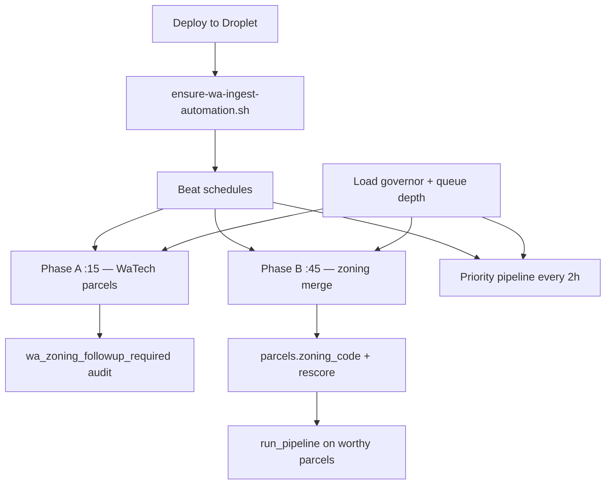

# WA ingest automation (hands-off)

Production deploys **automatically turn on** the full Washington data pipeline. No manual GitHub Action is required after merge.

## What runs on every deploy

After `docker compose up`, **Deploy to Droplet** runs:

```bash
scripts/ensure-wa-ingest-automation.sh
```

That script sets (or confirms) in `deploy/.env`:

| Flag | Schedule | Role |
|------|----------|------|
| `WA_STATEWIDE_ROLLOUT_ENABLED=true` | hourly `:15` UTC | **Phase A** — next county parcels from WaTech when queue + load governor allow |
| `WA_PHASE_B_ROLLOUT_ENABLED=true` | hourly `:45` UTC | **Phase B** — zoning overlay merge on loaded counties when capacity allows |
| `SCHEDULED_PRIORITY_PIPELINE_ENABLED=true` | every 2h `:20` | Top entitlement parcels still get pipeline jobs |
| `SCHEDULED_ENQUEUE_UNSCORED_LIMIT=75` | (with priority) | Backlog drain cap |

If any value changed, **api + worker + beat** are recreated. When `INTERNAL_API_KEY` is set, the script also POSTs:

- `/internal/ingest/wa-rollout-now`
- `/internal/ingest/wa-phase-b-rollout-now`

…so work starts immediately when the server is healthy (otherwise Beat retries on the next tick).

Post-deploy **ops-refresh** enqueues one immediate watchdog, ops remediation, Phase A tick, and Phase B tick inside the API container.

## End-to-end flow



## Capacity gates (shared)

Both Phase A and Phase B skip when:

- Load governor pressure is **orange/red**
- Parking Celery queue exceeds configured max (400 Phase A, 300 Phase B by default)
- County cooldown / pending lock is active

See `services/api/app/load_governor.py` and rollout YAML configs.

## Phase B county coverage

Phase B runs **automatically only for counties with an overlay builder or staged file** in `config/wa_phase_b_rollout.yaml`.

Today:

- **Benton (`53005`)** — `auto_build_overlay: true` (Tri-Cities GIS)
- Other loaded counties — flagged by `wa_zoning_followup_required` until sources + config are added

Adding a county to Phase B automation = curate GIS sources, registry rows, and a `counties:` block (or overlay path).

## Manual overrides

| Action | When |
|--------|------|
| **Droplet resources → pause_wa_statewide_rollout** | Pause Phase A only |
| **Droplet resources → prioritize_baltimore_market** | Baltimore-first; pauses WA |
| **Droplet resources → relieve_load** | Emergency queue purge |
| Set `KICKSTART_WA_AUTOMATION=false` on deploy step | Skip immediate POST kickstart |

## Status endpoints

```bash
GET /internal/ingest/wa-rollout-status
GET /internal/ingest/wa-phase-b-rollout-status
GET /internal/stats/load-governor
```

GitHub Actions → **Droplet resources** → `wa_rollout_status`, `wa_phase_b_rollout_status`, `zoning_followup_report`.

## Related docs

- [WA_STATEWIDE_ROLLOUT.md](WA_STATEWIDE_ROLLOUT.md) — Phase A detail
- [WA-PHASE-B-ROLLOUT.md](WA-PHASE-B-ROLLOUT.md) — Phase B detail
- [ZONING-GOVERNANCE.md](ZONING-GOVERNANCE.md) — source registry workflow
